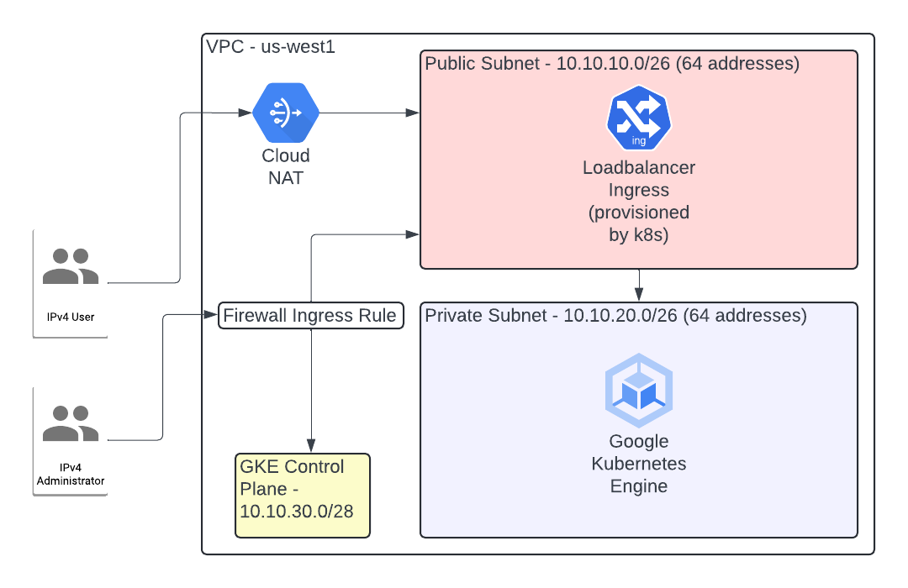

# Polarstomps GCP Environment Terraform Module

## About

This Terraform module is used to provision an opinionated GCP environment for the Polarstomps web application. It deploys all resources in **us-west1** by default.

It will deploy:

* A VPC with a public and private subnet
* A VPC route that allows egress to the Internet
* Firewall rules to enable ingress from a "home" IP address
* A [Cloud Router](https://cloud.google.com/network-connectivity/docs/router/concepts/overview) and a [Cloud Nat](https://cloud.google.com/nat/docs/overview) in order to enable routing to a private GKE cluster
* A GKE/Kubernetes autopilot cluster that has private nodes and a public control plane endpoint (that is locked down to that same "home" IP address)

The philosphy of the module is that it enforces a set of hypothetical standards for an organization - i.e, the Polarstomps organization. It assumes that environments would be relatively homogenous and so works to enforce a set of defaults and minimize the need for creating wrapper modules to set inputs.

However, it also gives you an escape hatch for customizing the underlying environment. For the average instantiation, the only real inputs are an environment string (dev/stage/prod) and subnet cidrs.

### One Cluster One Environment

This module defines a logical environment as "one cluster in one VPC." This is fairly simplistic but so is the problem. If you need multiple clusters per environment (say you want a cluster solely dedicated to processing HIPAA or PII data) then this module isn't for you. It would need to be refactored so that the GKE cluster is its own module. For the Polarstomps web application, centralizing everything into one module provides simplicity.

### Network Layout

By default, this module creates the below diagram:



## Post Cluster Creation

You can populate your `~/.kube/config` with auth details for the provisioned cluster by running: `gcloud container clusters get-credentials $(terragrunt output -raw gke_cluster_name) --zone us-west1`. If you customize the region then you'll need to change the shell command.

After you setup your kubeconfig, you can then bootstrap ArgoCD like so:

``` sh
kubectl create namespace argocd
kubectl apply -n argocd -f https://raw.githubusercontent.com/argoproj/argo-cd/stable/manifests/install.yaml
```

And then to login to it you:

``` sh
kubectl config set-context --current --namespace argocd
argocd login --core
argocd admin initial-password -n argocd
```

Port forward into the ArgoCD UI `kubectl port-forward svc/argocd-server -n argocd 8080:443` and then use the password generated from the above shell to look at the UI.

### Customization and Usage

An example of using this module is in the [polarstomps-infra-gcp]() repository as its used to deploy the dev and prod environments.

A very basic usage looks like this:

``` terraform
module "prod" {
  source              = "."
  env                 = "prod"
  project_id          = "foobar"
  public_subnet_cidr  = "10.10.40.0/26"
  private_subnet_cidr = "10.10.50.0/26"
  control_plane_cidr  = "10.10.60.0/28"
  
  # The IP address that is allowed to contact the GKE control plane.
  #
  # It's also allowed to SSH into the public subnet by default.
  #
  my_ip_address       = "1.1.1.1/32"
}
```

Note, this module uses `coalesce` and `coalescelist` in order to make the tradeoff of DRY module instantiation with slightly obscured defaults.

Generally, this means that any list of objects has a default defined in the `locals` block of `main.tf` rather than the defaults of `variables.tf`.

#### Customizing Firewall Rules

``` terraform
module "environment" {
  env                 = "prod"
  public_subnet_cidr  = "10.10.40.0/26"
  private_subnet_cidr = "10.10.50.0/26"
  control_plane_cidr  = "10.10.60.0/28"
  
  # Disable ingress on 22 for a home address
  #
  # If this is set to true and my_ip_address
  # is defined then a 22 ingress rule would be
  # created for the public_subnet_cidr.
  #
  vpc_enable_my_ip_ingress_rule = false
  
  # We still need to set an IP address for the public control plane even if
  # we're not using that same address to SSH into the public subnet.
  #
  my_ip_address = "1.1.1.1/32"
  
  # Define your own rules. You rebel you.
  #
  vpc_firewall_rules = [
    {
      name               = "foobar"
      description        = "foobar"
      direction          = "INGRESS"
      priority           = 0
      destination_ranges = ["0.0.0.0/16"]
      source_ranges      = ["1.1.1.1/32"]
      
      allow = [{
        protocol = "tcp"
        ports    = ["22"]
      }]
    }
  ]
}
```

#### Customizing VPC Subnets

``` terraform
module "environment" {
  env = "prod"
 
  # The node subnet name and the private subnet name need to match
  #
  # Or, really, the subnet name that you want the GKE worker nodes to be
  # created in needs to match the private subnet name. The worker pools
  # have to live somewhere and you get to choose where.
  #
  gke_node_subnet_name = "private"
  
  vpc_subnets = [
    {
      subnet_name   = "public"
      subnet_ip     = "10.0.10.0/16"
      subnet_region = "us-west1"
      description   = "foobar"
    },
    {
      subnet_name   = "private"
      subnet_ip     = "10.0.20.0/16"
      subnet_region = "us-west1"
      description   = "foobar"
    }
  ]
}
```

#### Customizing VPC routes

``` terraform
module "environment" {
  env = "prod"
  
  vpc_routes = [{
    name              = "egress"
    description       = "egress"
    destination_range = "0.0.0.0/0"
    tags              = "egress-inet"
    next_hop_internet = "true"
  }]
}
```

#### Testing

This module was tested by instantiating different configurations in the Polarstomps GCP infra repository and then running `terragrunt apply` and seeing if it produced functional infrastructure.

TODO: Set up [Terratest](https://terratest.gruntwork.io/).

# Terraform-docs

The below is generated by [terraform-docs](https://terraform-docs.io/). The defaults column of the inputs should be taken with a grain of salt after reading the above.

## Requirements

| Name | Version |
|------|---------|
| <a name="requirement_terraform"></a> [terraform](#requirement\_terraform) | >=1.3 |
| <a name="requirement_google"></a> [google](#requirement\_google) | >= 5.40.0, != 5.44.0, != 6.2.0, != 6.3.0, < 7 |

## Providers

| Name | Version |
|------|---------|
| <a name="provider_google"></a> [google](#provider\_google) | >= 5.40.0, != 5.44.0, != 6.2.0, != 6.3.0, < 7 |

## Modules

| Name | Source | Version |
|------|--------|---------|
| <a name="module_firewall_rules"></a> [firewall\_rules](#module\_firewall\_rules) | terraform-google-modules/network/google//modules/firewall-rules | ~> 9.0.0 |
| <a name="module_gke_cluster"></a> [gke\_cluster](#module\_gke\_cluster) | terraform-google-modules/kubernetes-engine/google//modules/beta-autopilot-private-cluster | ~> 33.0 |
| <a name="module_routes"></a> [routes](#module\_routes) | terraform-google-modules/network/google//modules/routes | ~> 9.0.0 |
| <a name="module_subnets"></a> [subnets](#module\_subnets) | terraform-google-modules/network/google//modules/subnets | ~> 9.0.0 |
| <a name="module_vpc"></a> [vpc](#module\_vpc) | terraform-google-modules/network/google//modules/vpc | ~> 9.0.0 |

## Resources

| Name | Type |
|------|------|
| [google_compute_router.router](https://registry.terraform.io/providers/hashicorp/google/latest/docs/resources/compute_router) | resource |
| [google_compute_router_nat.nat](https://registry.terraform.io/providers/hashicorp/google/latest/docs/resources/compute_router_nat) | resource |
| [google_client_config.default](https://registry.terraform.io/providers/hashicorp/google/latest/docs/data-sources/client_config) | data source |

## Inputs

| Name | Description | Type | Default | Required |
|------|-------------|------|---------|:--------:|
| <a name="input_env"></a> [env](#input\_env) | What to name a logical environment | `string` | n/a | yes |
| <a name="input_gke_control_plane_cidr"></a> [gke\_control\_plane\_cidr](#input\_gke\_control\_plane\_cidr) | The cidr block for the GKE control plane. | `string` | `"10.10.30.0/28"` | no |
| <a name="input_gke_deletion_protection"></a> [gke\_deletion\_protection](#input\_gke\_deletion\_protection) | Deletino protection. I'm not made of money so this is false by default. | `string` | `false` | no |
| <a name="input_gke_enable_private_endpoint"></a> [gke\_enable\_private\_endpoint](#input\_gke\_enable\_private\_endpoint) | Whether or not to make the control plane endpoint private to a subnet | `string` | `false` | no |
| <a name="input_gke_enable_private_nodes"></a> [gke\_enable\_private\_nodes](#input\_gke\_enable\_private\_nodes) | Hide them nodes. | `string` | `true` | no |
| <a name="input_gke_enable_vertical_pod_autoscaling"></a> [gke\_enable\_vertical\_pod\_autoscaling](#input\_gke\_enable\_vertical\_pod\_autoscaling) | Enabling GKE vertical pod autoscaling. | `bool` | `true` | no |
| <a name="input_gke_horizontal_pod_autoscaling"></a> [gke\_horizontal\_pod\_autoscaling](#input\_gke\_horizontal\_pod\_autoscaling) | Enabling GKE horizontal pod autoscaling. | `bool` | `true` | no |
| <a name="input_gke_kubernetes_version"></a> [gke\_kubernetes\_version](#input\_gke\_kubernetes\_version) | Which Kubernetes version to use for the cluster. | `string` | `"latest"` | no |
| <a name="input_gke_master_authorized_networks"></a> [gke\_master\_authorized\_networks](#input\_gke\_master\_authorized\_networks) | Use to override the default ingress rule that is constructed from var.my\_ip\_address | <pre>list(object({<br/>    cidr_block   = string<br/>    display_name = string<br/>  }))</pre> | `[]` | no |
| <a name="input_gke_network_tags"></a> [gke\_network\_tags](#input\_gke\_network\_tags) | GKE network tags. | `list(string)` | `[]` | no |
| <a name="input_gke_node_subnet_name"></a> [gke\_node\_subnet\_name](#input\_gke\_node\_subnet\_name) | The subnet name for nodes created by GKE autopilot | `string` | n/a | yes |
| <a name="input_gke_pods_range_cidr"></a> [gke\_pods\_range\_cidr](#input\_gke\_pods\_range\_cidr) | The cidr block for the GKE pods | `string` | `"192.168.0.0/18"` | no |
| <a name="input_gke_release_channel"></a> [gke\_release\_channel](#input\_gke\_release\_channel) | The release channel for GKE versions | `string` | `"REGULAR"` | no |
| <a name="input_gke_svc_range_cidr"></a> [gke\_svc\_range\_cidr](#input\_gke\_svc\_range\_cidr) | The cidr block for GKE services | `string` | `"192.168.64.0/18"` | no |
| <a name="input_my_ip_address"></a> [my\_ip\_address](#input\_my\_ip\_address) | A source IP used to connect to the k8s control plane | `string` | n/a | yes |
| <a name="input_nat_ip_allocate_option"></a> [nat\_ip\_allocate\_option](#input\_nat\_ip\_allocate\_option) | https://registry.terraform.io/providers/hashicorp/google/latest/docs/resources/compute_router_nat#nat_ip_allocate_option | `string` | `"AUTO_ONLY"` | no |
| <a name="input_nat_source_subnetwork_ip_ranges_to_nat"></a> [nat\_source\_subnetwork\_ip\_ranges\_to\_nat](#input\_nat\_source\_subnetwork\_ip\_ranges\_to\_nat) | https://registry.terraform.io/providers/hashicorp/google/latest/docs/resources/compute_router_nat#source_subnetwork_ip_ranges_to_nat | `string` | `"ALL_SUBNETWORKS_ALL_IP_RANGES"` | no |
| <a name="input_project_id"></a> [project\_id](#input\_project\_id) | n/a | `string` | n/a | yes |
| <a name="input_region"></a> [region](#input\_region) | n/a | `string` | `"us-west1"` | no |
| <a name="input_vpc_auto_create_subnets"></a> [vpc\_auto\_create\_subnets](#input\_vpc\_auto\_create\_subnets) | Whether or not to automatically create VPC subnets. This should almost always be off. | `bool` | `false` | no |
| <a name="input_vpc_enable_my_ip_ingress_rule"></a> [vpc\_enable\_my\_ip\_ingress\_rule](#input\_vpc\_enable\_my\_ip\_ingress\_rule) | Whether or not to create an ingress rule for a home IP address. Is added to var.vpc\_firewall\_rules. If set then you need to set var.vpc\_public\_subnet\_cidr to your public subnet cidr block. | `bool` | `true` | no |
| <a name="input_vpc_firewall_rules"></a> [vpc\_firewall\_rules](#input\_vpc\_firewall\_rules) | Use to define firewall rules | <pre>list(object({<br/>    name = string<br/>    description        = string<br/>    direction          = string<br/>    priority           = number<br/>    destination_ranges = list(string)<br/>    source_ranges      = list(string)<br/><br/>    allow = list(object({<br/>      protocol = string<br/>      ports    = list(string)<br/>    }))<br/>  }))</pre> | `[]` | no |
| <a name="input_vpc_private_subnet_cidr"></a> [vpc\_private\_subnet\_cidr](#input\_vpc\_private\_subnet\_cidr) | The cidr block for the private subnet | `string` | `"10.10.20.0/26"` | no |
| <a name="input_vpc_private_subnet_name"></a> [vpc\_private\_subnet\_name](#input\_vpc\_private\_subnet\_name) | The name of the VPC private subnet. Default: infra-$(env)-private-01 | `string` | `""` | no |
| <a name="input_vpc_private_subnet_secondary_ranges"></a> [vpc\_private\_subnet\_secondary\_ranges](#input\_vpc\_private\_subnet\_secondary\_ranges) | Use to override the creation of secondary subnet ranges for GKE worker node allocations. | <pre>list(object({<br/>    range_name    = string<br/>    ip_cidr_range = string<br/>  }))</pre> | `[]` | no |
| <a name="input_vpc_public_subnet_cidr"></a> [vpc\_public\_subnet\_cidr](#input\_vpc\_public\_subnet\_cidr) | The cidr block for the public subnet | `string` | `"10.10.10.0/26"` | no |
| <a name="input_vpc_public_subnet_name"></a> [vpc\_public\_subnet\_name](#input\_vpc\_public\_subnet\_name) | The name of the VPC public subnet. Default: infra-$(env)-public-01 | `string` | `""` | no |
| <a name="input_vpc_routes"></a> [vpc\_routes](#input\_vpc\_routes) | Use to override the default VPC routes. | <pre>list(object({<br/>    name              = string<br/>    description       = string<br/>    destination_range = string<br/>    tags              = string<br/>    next_hop_internet = string<br/>  }))</pre> | `[]` | no |
| <a name="input_vpc_routing_mode"></a> [vpc\_routing\_mode](#input\_vpc\_routing\_mode) | https://registry.terraform.io/providers/hashicorp/google/latest/docs/resources/compute_network#routing_mode | `string` | `"GLOBAL"` | no |
| <a name="input_vpc_shared_vpc_host"></a> [vpc\_shared\_vpc\_host](#input\_vpc\_shared\_vpc\_host) | Whether or not to setup a VPC as a 'shared VPC.' | `bool` | `false` | no |
| <a name="input_vpc_subnets"></a> [vpc\_subnets](#input\_vpc\_subnets) | Use to override the creation of the default subnets. There be dragons here. | <pre>list(object({<br/>    subnet_name   = string<br/>    subnet_ip     = string<br/>    subnet_region = string<br/>    description   = string<br/>  }))</pre> | `[]` | no |

## Outputs

| Name | Description |
|------|-------------|
| <a name="output_gke_cluster_endpoint"></a> [gke\_cluster\_endpoint](#output\_gke\_cluster\_endpoint) | n/a |
| <a name="output_gke_cluster_name"></a> [gke\_cluster\_name](#output\_gke\_cluster\_name) | n/a |
| <a name="output_vpc_network_id"></a> [vpc\_network\_id](#output\_vpc\_network\_id) | n/a |
| <a name="output_vpc_network_name"></a> [vpc\_network\_name](#output\_vpc\_network\_name) | n/a |
| <a name="output_vpc_network_subnets"></a> [vpc\_network\_subnets](#output\_vpc\_network\_subnets) | n/a |
